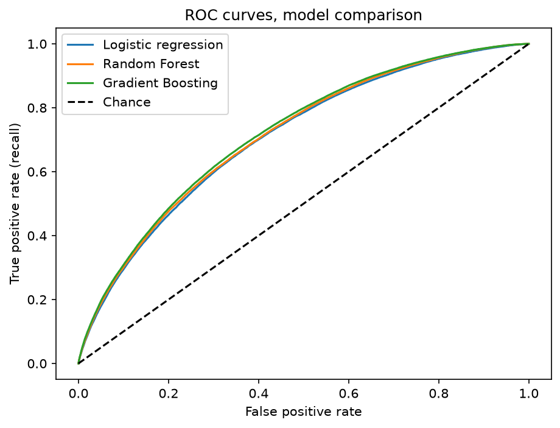
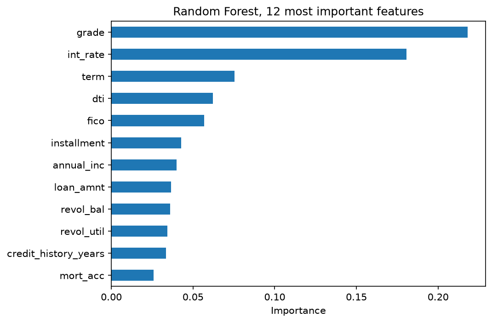

# Loan Default Prediction, Lending Club (2007-2018)

Predicting if a personal loan will be paid back or not, **using only what the lender knows on approval day**. Built on 1.34M finished loans from the public [Lending Club dataset](https://www.kaggle.com/datasets/wordsforthewise/lending-club).

Five model families compared with a business-driven metric. The core design decision: strict control of data leakage.

## Results

| Model | Accuracy | Precision | Recall | F1 | ROC AUC | Train time |
|---|---|---|---|---|---|---|
| Logistic Regression (balanced) | 0.66 | 0.32 | 0.64 | 0.43 | 0.71 | 5 s |
| Decision Tree (depth 7) | 0.63 | 0.30 | 0.68 | 0.42 | 0.70 | 16 s |
| Linear SVM (LinearSVC) | 0.66 | 0.32 | 0.64 | 0.43 | n/a | 18 s |
| Random Forest (100 trees) | 0.66 | 0.32 | 0.64 | 0.43 | 0.71 | 102 s |
| **Gradient Boosting (HistGB)** | 0.65 | 0.32 | **0.68** | **0.43** | **0.72** | 24 s |

An AUC of 0.72 is at the top of the published range (0.69-0.73) for setups without leakage on this dataset. Kaggle notebooks that report 0.90+ almost always use columns created after the loan was granted. The most interesting result is that five very different algorithms end up almost tied: the limit comes from the information available at origination, not from the model.



## Why leakage control is the whole game

The raw dataset has 151 columns, but most of them describe what happened **after** the loan was granted: payments, recoveries, updated FICO scores, hardship programs. Training with those columns means training with the answer.

Every feature had to pass one test: *did the lender know this on approval day?* That left 28 columns covering the loan terms, the applicant profile and their credit history. After removing redundant and high-cardinality fields, 24 predictors remained. Each exclusion was measured, not assumed. For example, the US state separates default rates by about 10 points between large states, not enough to justify adding 50 dummy variables.

Two details worth noting:

- `grade` and `int_rate` are set by the platform on approval day, so they are **not** leakage. But they contain the lender's own risk assessment, and as expected they came out as the strongest predictors.
- The detailed credit-bureau block only exists from 2013 (checked year by year). The FICO score covers the whole period and summarizes it.

## Business framing

With a 20% default rate, accuracy is useless: predicting "everyone pays" already scores 0.80. The chosen metric was **recall of the default class**, based on a simple cost comparison: a missed default loses the loan amount (about $15K), while rejecting a good payer only loses the interest (about $2.5K), a 7 to 1 ratio.

At the standard threshold, a logistic regression without class balancing detects only 8.5% of defaults. With balanced class weights, the winning model detects 36,364 of the 53,602 defaults in the test set (68%), at the cost of flagging 77,650 good payers. With the estimated costs, the expected loss drops from about $804M (approve everything) to about $453M. The decision threshold can still be adjusted to the lender's risk policy.



## EDA highlights

- The default rate grows step by step across every risk variable: platform grade goes from 6% of defaults in A loans to 50% in G loans, interest rate bands from 8% to 41%, and FICO bands from 25% (lowest scores) to 7% (highest).
- 60-month loans default twice as much as 36-month loans (32% vs 16%): more time exposed to problems, and borrowers who need longer terms usually start in a tighter position.
- Missing values carry signal: applicants who didn't declare their employment length default at 27%, seven points above average. That group was kept as its own category.
- About 2,750 rows (0.2%) were removed for impossible values: negative debt-to-income ratios, a 999 placeholder, and declared incomes of $0 or up to $11M.

## Known limitations

- The model only learns from **approved** loans; rejected applicants are not in the data.
- The 2017-2018 loans in the data are only the ones that finished early.
- Income is self-declared and often not verified.

## Repository structure

```
notebooks/loan_default_prediction.ipynb   # full analysis: EDA, preprocessing and models
figures/                                  # result charts
```

## Reproducing

1. Download `accepted_2007_to_2018Q4.csv` from [Kaggle](https://www.kaggle.com/datasets/wordsforthewise/lending-club) into `data/` (gitignored, 1.6 GB).
2. `pip install -r requirements.txt`
3. Run the notebook top to bottom (about 15 minutes on a regular laptop; the full 2.26M-row file loads with `usecols` in under a minute).

## References

- Namvar, A. et al. (2018), *Credit risk prediction in an imbalanced social lending environment*, [arXiv:1805.00801](https://arxiv.org/abs/1805.00801), the reference paper for leakage-aware results on this dataset.
- [scikit-learn documentation](https://scikit-learn.org/stable/)
